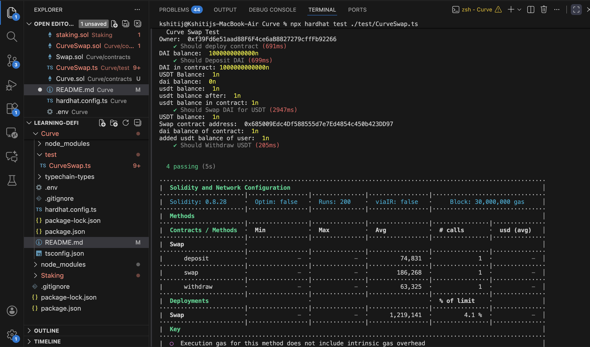

# Overview

**Curve** is an **Automated Market Maker (AMM)** protocol designed specifically for **stablecoin swaps**, with the primary goal of **minimizing slippage**.

---

## 🧩 The Problem with Traditional AMMs

Traditional AMMs like **Uniswap** use the **constant product formula**:

> **x × y = k**

This model works well for **volatile asset pairs** such as **ETH/WBTC**, but it introduces problems for stablecoins.

### How it behaves:

- Swapping token **x** for **y** reduces the pool balance of **y**
- This immediately increases the price of **y**
- Subsequent swaps become more expensive due to the enforced invariant

⚠️ **For stablecoins (DAI, USDT, USDC)** — assets designed to stay close to **$1** — this behavior is undesirable.
Even small reserve imbalances can lead to **noticeable price deviations**, which defeats the purpose of stablecoin swaps.

👉 **Conclusion:**
Constant product AMMs are **not optimal** for stablecoin pools.

---

## 🚀 How Curve Solves This

Curve introduces a **modified AMM invariant** that includes an **amplification factor (`A`)**.

- `A` is **governed by Curve DAO voting**
- It controls how aggressively the pool penalizes imbalance

### Behavior based on `A`:

- 🔼 **High `A`**

  - Pool behaves closer to a **constant sum AMM**
  - Formula intuition: **x + y = k**
  - Result: **Extremely low slippage near the peg**

- 🔽 **Low `A`**
  - Pool behaves closer to a **constant product AMM**
  - Formula intuition: **x × y = k**
  - Result: **Higher slippage as imbalance increases**

📌 This design allows Curve to **dynamically interpolate** between constant sum and constant product behavior.

---

## 🛡️ Why This Matters

Curve pools offer:

- ✅ **Minimal slippage** for stablecoin swaps
- ✅ **Low fees** (typically ~0.04%)
- ✅ **Strong LP protection**

If a trader attempts to **drain one side of the pool**:

- Slippage increases sharply
- Trades become economically unviable
- Liquidity providers remain protected

---

## 📊 Example: Uniswap vs Curve

### Pool Setup

- **1,000 DAI**
- **1,000 USDT**

---

### 🔴 Uniswap (x × y = k)

- A user swaps **100 DAI → USDT**
- The pool becomes imbalanced
- The invariant immediately penalizes the trade
- ❌ The user receives **significantly less than 100 USDT**

---

### 🟢 Curve (High `A`)

- The pool assumes both assets should remain close to $1
- Near equilibrium, the pricing curve is **almost flat**
- ✅ The user receives **very close to 100 USDT** (minus a small fee)

📈 As imbalance grows, Curve **gradually increases slippage**, eventually behaving like a constant product AMM to protect liquidity providers.

---

**💡 Key Insight:**
Curve is optimized for **stable value assets**, while still remaining secure under extreme conditions.

# Token Decimals & Normalization

Token **normalization** is one of the most important concepts in **Curve contracts**, because ERC-20 tokens can have **different decimal precisions**.

### Common Stablecoin Decimals

- **DAI** → 18 decimals
- **USDC** → 6 decimals
- **USDT** → 6 decimals

---

## 🧮 Why Normalization Is Required

On-chain balances are stored as **integers**, not floating-point numbers.

That means:

- **1 DAI** = `1 × 10¹⁸`
- **1 USDC** = `1 × 10⁶`

If these **raw balances** are directly plugged into an AMM formula:

- Prices become **incorrect**
- Slippage calculations become **meaningless**
- The pool would incorrectly favor higher-decimal tokens

⚠️ AMMs must compare **value**, not raw integer magnitude.

---

## 🔄 How Curve Normalizes Balances

Curve converts all token balances to a **common precision**, typically **18 decimals**, before applying any AMM logic.

### Normalization Formula

```bash
normalizedBalance = rawBalance × (10^(18 - tokenDecimals));
```

| Token | Raw Balance | Decimals | Normalized Balance |
| ----- | ----------- | -------- | ------------------ |
| DAI   | `1e18`      | 18       | `1e18`             |
| USDT  | `1e6`       | 6        | `1e18`             |

Now, normalizedDAI == normalizedUSDT, ensuring correct prices and slippage math.

# Swap Flow (Technical deep dive)

Unlike Uniswap’s constant product AMM (x \* y = k), Curve uses a stable-swap invariant that:

- Behaves like constant sum near equilibrium (low slippage)
- Gradually shifts toward constant product when the pool becomes imbalanced

## 1. The StableSwap Invariant (D)

Curve does not keep **x \* y** constant, instead it maintains a variable called **D**, which represents the **total normalised liquidity** of the pool.

**Intuition:**

- **D ≈ total value locked**
- If balances are equal → **low slippage**
- If balances diverge → **slippage increases automatically**

In Curve, **D is preserved approximately, not exactly**.
**Why?** → Fees, Rounding, Numerical approximation, Amplification factor changes curvature.
The goal is **price stability**, not mathematical inequality.

### Computing D (\_getD)

```bash
function _getD(uint x, uint y) internal view returns (uint D)
```

This function computes the **stable swap invariant D**:

- Uses **Newton-Raphson iteration**
- Converges on a value of **D** that satisfies Curve's invariant

```bash
uint S = x + y;
D = S;
```

Start with a **reasonable initial guess**
When pool is balanced, **D ≈ x + y**

```bash
uint Ann = A \* 2;
```

**A (Amplification factor)** controls curvature.
Higher **A** behaves closer to **constant sum**.

### Why loop 64 times?

```bash
for (uint i = 0; i < 64; i++)
```

This is **not arbitrary**:

- Newton's method converges **very fast**
- **64** is a safe upper bound
- In practice convergence happens in **~5–10 iterations**

**Stopping condition:**

```bash
if (abs(D - Dprev) <= 1) break;
```

This pattern is used in **production contracts** — it is:

- Gas safe
- Deterministic
- Precision-safe

### What is D_P?

```bash
uint D_P = (D * D) / (x * y * 2 + 1);
```

**D_P measures imbalance between token reserves**:

- If **x ≈ y**, then **D_P is small**
- If pool is **imbalanced**, **D_P grows**

Acts like a **penalty term** for draining one side.

```bash
D = numerator / denominator;
```

This refines the guess for **D**, pushes the value toward **invariant equilibrium**, and guarantees convergence under normal conditions.

## 2. Swap token overview

```bash
function swap(...)
```

Swap:

- Takes input transfer **amountIn**
- Applies fee
- Computes invariant **D**
- Finds new output balance via iteration
- Transfers token
- Updates reserves

### Why there's a loop in Swap too?

Given:

- New **x** after deposit
- Old invariant **D**

We must find **y** such that:
**\_getD(xNew, y) ≈ D**
There is **no direct formula for y**.

### Iterative solve for output amount

```bash
for (uint i = 0; i < 64; i++) {
    uint Dcalc = _getD(xNew, yFinal);

    if (Dcalc > D) {
        yFinal -= diff / (2 + A);
    } else {
        yFinal += diff / (2 + A);
    }
}
```

This loop:

- Adjusts **yFinal**
- Minimizes difference between **Dcalc** and **D**
- Stops when precision is acceptable

**Think of it as:**
→ Slide **y** until the invariant is preserved.

## 3. Why this complexity is unavoidable

Curve’s design trades:

- **Simplicity** ❌
- **Mathematical elegance** ❌

For:

- **Capital efficiency** ✅
- **Peg stability** ✅
- **Minimal slippage** ✅

# Tests and edge cases

## Mainnet Fork Testing

All tests are executed using **Hardhat mainnet forking**, interacting with **real deployed contracts**:

- **DAI** (18 decimals)
- **USDT** (6 decimals, non-standard ERC20)

A real **DAI whale address** is impersonated to simulate realistic liquidity conditions.
ETH balance is manually injected using `hardhat_setBalance` to cover gas costs.

This ensures the implementation behaves correctly under **real-world token constraints**, not mocked contracts.

---

## Core Swap Flow Validation

The test suite validates the **full swap lifecycle**:

### Contract deployment

- Ownership initialization
- Correct contract setup

### Token deposit

- User deposits real **DAI** into the contract
- ERC20 allowance and balance checks
- Internal accounting via `balances[user][token]`

### Swap execution

- Swap **DAI → USDT** using Curve invariant
- Invariant **D** is preserved during swap
- Output amount reflects **low-slippage behavior**
- Internal balances update correctly

### Withdrawal

- User withdraws swapped **USDT**
- Token transfer succeeds for **non-standard ERC20**
- User balance increases correctly

---

## Balance Accounting and Safety

The following **safety guarantees** are validated:

- Users cannot withdraw more than their internal balance
- Internal accounting matches actual ERC20 balances
- Swap fails if slippage exceeds `minAmountOut`
- Reserves are updated after every state-changing operation

---

## Edge Cases and Limitations

The implementation considers several important edge cases:

### Non-standard ERC20 behavior

- USDT does not return a boolean on transfer, requiring **SafeERC20 handling**

### Token decimal differences

- DAI (18 decimals) and USDT (6 decimals) require **normalization logic** in production-grade implementations

### Iterative convergence

- Curve’s invariant is solved numerically using **bounded iterations (max 64)**
- Guarantees convergence without excessive gas usage

### Not supported

- Fee-on-transfer tokens
- Rebase tokens
- Pools with extreme imbalance

---

## Testing results



---

# Key Takeaways

- Curve is optimized for **stablecoin swaps**, where preserving **price parity** is more important than price discovery.

- Unlike Uniswap’s constant product invariant (**x \* y = k**), Curve uses a **hybrid invariant** that smoothly interpolates between:

  - **Constant sum** (low slippage near equilibrium)
  - **Constant product** (safety under imbalance)

- The **amplification factor (A)** controls slippage:

  - High **A** → behaves like constant sum near equal balances
  - Low **A** → behaves like constant product when pools are imbalanced

- Curve’s invariant **cannot be solved analytically**, so swaps rely on **iterative numerical methods (Newton iterations)** with bounded loops to ensure convergence and gas safety.

- Maintaining an **approximately constant invariant D** (rather than an exact constant) allows Curve to offer low slippage while still preventing pool drain attacks.

- Real-world DeFi engineering must account for **non-standard ERC20 behavior**, such as USDT not returning boolean values on transfers.

- **Mainnet-fork testing is essential** for DeFi protocols, as mocked tokens often hide critical edge cases related to decimals, approvals, and transfer behavior.

- Small implementation details—like convergence thresholds, iteration limits, and balance accounting—have **direct financial and security implications**.
